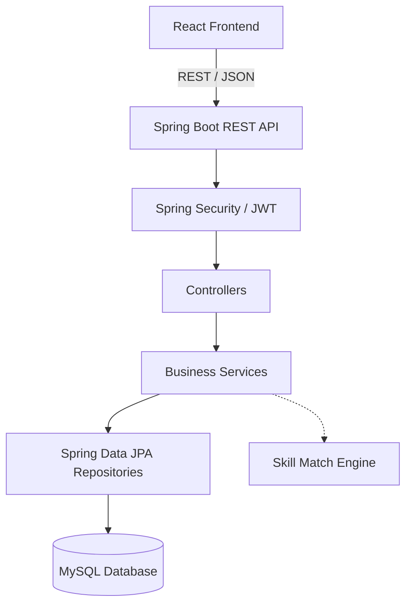
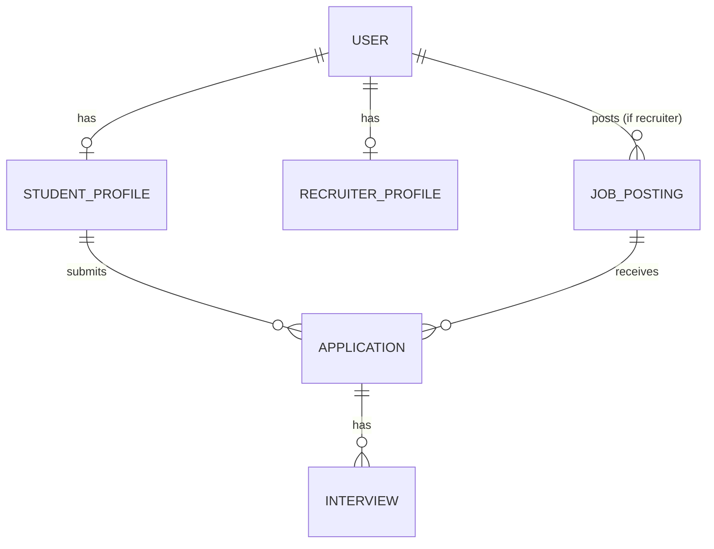

# CampusConnect — Campus Placement Management & Recruitment Portal

> **"Where Talent Meets Opportunity"**

A full-stack campus placement portal connecting students, recruiters, and placement administrators — with a built-in resume-based skill matching engine.

---

## Tech Stack

| Layer | Technology |
|-------|-----------|
| Backend | Java 17 + Spring Boot 3.2, Spring Security, Spring Data JPA |
| Auth | JWT (jjwt 0.12.x), Role-based Authorization |
| Database | MySQL 8 |
| Frontend | React 18 + Vite + Tailwind CSS v3 |
| Build | Maven 3.9 |

---

## Architecture



## Entity-Relationship (ER) Diagram



---

## Roles

| Role | Description |
|------|-------------|
| `ROLE_STUDENT` | Browse jobs, apply, track application status, build profile |
| `ROLE_RECRUITER` | Post jobs, view applicants with skill-match scores, update status |
| `ROLE_ADMIN` | Manage users, approve recruiters, view placement statistics |

---

## Project Structure

```
CampusConnect/
├── backend/                   # Spring Boot application
│   ├── src/main/java/com/campusconnect/
│   │   ├── config/            # SecurityConfig, DataSeeder
│   │   ├── controller/        # AuthController, StudentController, RecruiterController, AdminController
│   │   ├── dto/               # Request/Response DTOs
│   │   ├── entity/            # JPA entities (User, Role, StudentProfile, JobPosting, Application)
│   │   ├── exception/         # Global exception handling
│   │   ├── repository/        # Spring Data JPA repositories
│   │   ├── security/          # JWT filter, UserDetails implementation
│   │   └── service/           # Business logic services + SkillMatchService
│   └── src/main/resources/
│       └── application.properties
├── frontend/                  # React + Vite application
├── Gemini.MD                  # Implementation plan
├── Brandguidelines.MD         # Design system & brand guidelines
└── .gitignore
```

---

## Getting Started

### Prerequisites
- Java 17
- Maven 3.9+
- MySQL 8
- Node.js 18+

### Backend Setup

```bash
# 1. Create DB and user
mysql -u root -e "
  CREATE DATABASE campusconnect;
  CREATE USER 'ccuser'@'localhost' IDENTIFIED BY 'CampusConnect@2024';
  GRANT ALL PRIVILEGES ON campusconnect.* TO 'ccuser'@'localhost';
  FLUSH PRIVILEGES;
"

# 2. Run the backend (Hibernate auto-creates tables on first boot)
cd backend
mvn spring-boot:run
```

The DataSeeder automatically creates all three roles and a default admin account:
- **Admin:** `admin@campusconnect.com` / `Admin@123`

### Frontend Setup

```bash
cd frontend
npm install
npm run dev
```

---

## API Endpoints

### Auth (Public)
| Method | Endpoint | Description |
|--------|----------|-------------|
| POST | `/api/auth/register` | Register (role: STUDENT or RECRUITER) |
| POST | `/api/auth/login` | Login → returns JWT |

### Student (requires `ROLE_STUDENT`)
| Method | Endpoint | Description |
|--------|----------|-------------|
| GET/PUT | `/api/student/profile` | Get/update profile |
| POST | `/api/student/profile/resume` | Upload resume |
| GET | `/api/student/jobs` | Browse active jobs (supports `?keyword=`) |
| POST | `/api/student/jobs/{id}/apply` | Apply with cover letter |
| GET | `/api/student/applications` | My applications |

### Recruiter (requires `ROLE_RECRUITER`)
| Method | Endpoint | Description |
|--------|----------|-------------|
| GET/PUT | `/api/recruiter/profile` | Company profile |
| GET/POST | `/api/recruiter/jobs` | List / create job postings |
| PUT/DELETE | `/api/recruiter/jobs/{id}` | Update / delete job |
| GET | `/api/recruiter/jobs/{id}/applications` | View applicants |
| PATCH | `/api/recruiter/applications/{id}/status` | Update application status |

### Admin (requires `ROLE_ADMIN`)
| Method | Endpoint | Description |
|--------|----------|-------------|
| GET | `/api/admin/stats` | Dashboard stats |
| GET | `/api/admin/users` | All users |
| PATCH | `/api/admin/users/{id}/toggle` | Enable/disable user |
| DELETE | `/api/admin/users/{id}` | Delete user |
| GET | `/api/admin/recruiters/pending` | Pending recruiter approvals |
| POST | `/api/admin/recruiters/{id}/approve` | Approve recruiter |

---

## Skill Matching Engine

When a student applies for a job, the system computes a **skill match score (0–100)**:

```
score = (matching skills / total required skills) × 100
```

Scores are displayed as color-coded badges:
- **80–100%** → Emerald (Excellent Match)
- **50–79%** → Amber (Good/Partial Match)
- **Below 50%** → Slate (Low Match — not shown as a failure state)

---

## Default Credentials

| Role | Email | Password |
|------|-------|----------|
| Admin | admin@campusconnect.com | Admin@123 |

---

## Phase Status

- [x] Phase 0 — Project Setup (Spring Boot, React, MySQL, Git)
- [x] Phase 1 — Core Auth & Data Layer (JWT, roles, entities)
- [x] Phase 2 — Student Module (profile, resume, job browsing, applications)
- [x] Phase 3 — Recruiter Module (jobs CRUD, applicant management)
- [x] Phase 4 — Admin Module (user management, recruiter approval, stats)
- [x] Phase 5 — Skill-Match Engine
- [x] Phase 6 — Polish & Interview-Readiness
- [ ] Phase 7 — Stretch Goals (Docker, CI/CD, Swagger)
